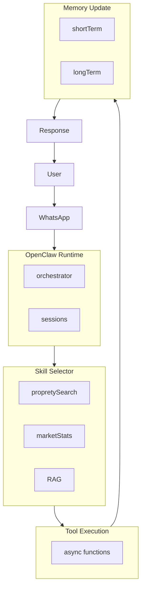

```mermaid
flowchart TD
    User --> WA[WhatsApp]
    WA --> OR
    OR --> SS
    SS --> TE
    TE --> MU
    MU --> R[Response]
    R --> User


    subgraph OR[OpenClaw Runtime]
        O[orchestrator]
        S[sessions]
    end

    subgraph SS[Skill Selector]
        PS[propretySearch]
        MS[marketStats]
        RAG[RAG]
    end

    subgraph TE[Tool Execution]
        A[async functions]
    end

    subgraph MU[Memory Update]
        ST[shortTerm]
        LT[longTerm]
    end


```
