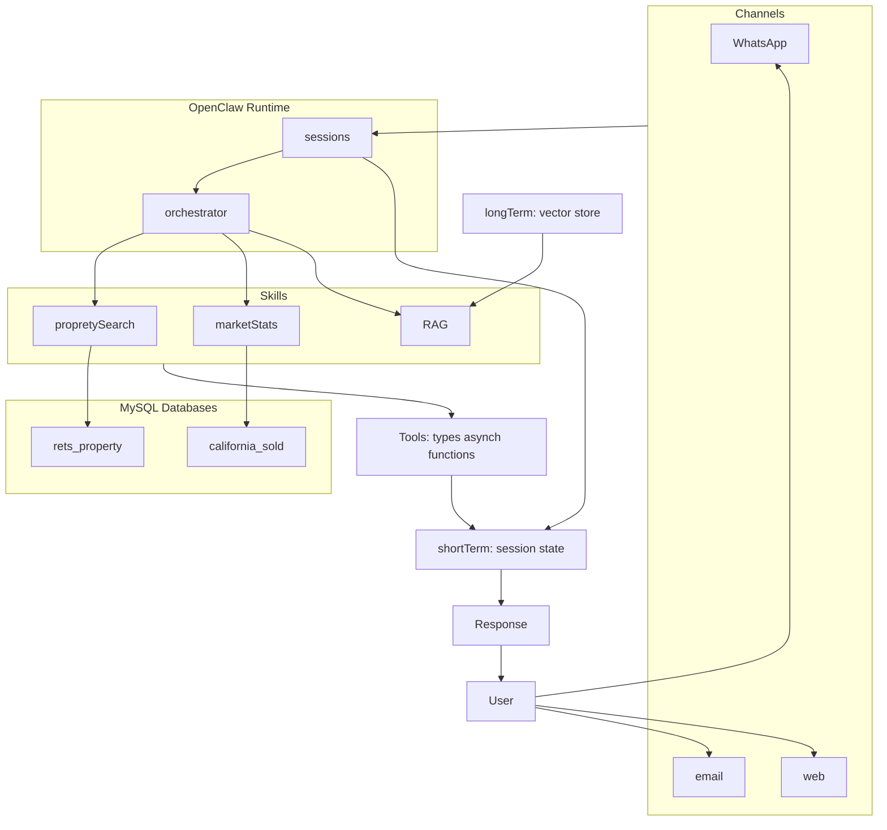

```mermaid
%% User → WhatsApp → OpenClaw Runtime → Skill Selector → Tool Execution → Memory Update → Response → User

flowchart TD
    subgraph Channels
        WA[WhatsApp]
        EM[email]
        WEB[web]
    end
    subgraph OR[OpenClaw Runtime]
        O[orchestrator]
        S[sessions]
    end
    subgraph Skills
        PS[propretySearch]
        MS[marketStats]
        RAG[RAG]
    end
    subgraph DB[MySQL Databases]
        RP[rets_property]
        CS[california_sold]
    end

    U[User] --> WA & EM & WEB
    Channels --> S --> O --> PS & MS & RAG
    S --> ST[shortTerm: session state]
    LT[longTerm: vector store] --> RAG
    Skills --> TE[Tools: types asynch functions] --> ST
    PS --> RP
    MS --> CS
    ST --> R[Response] --> U[User]

```
